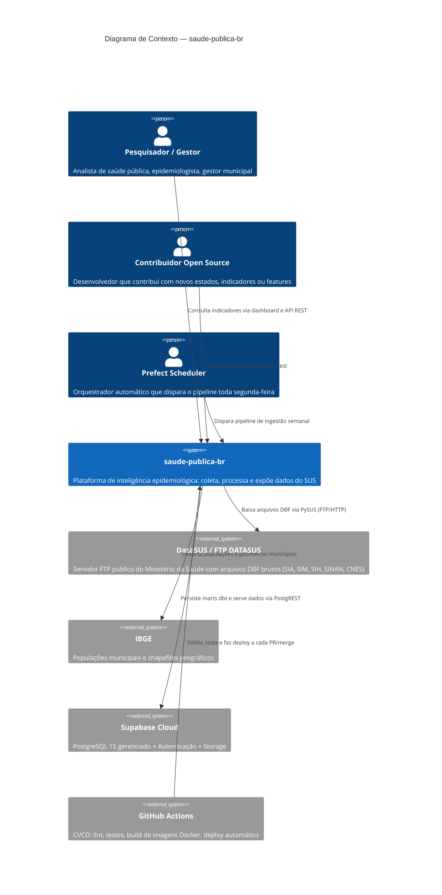
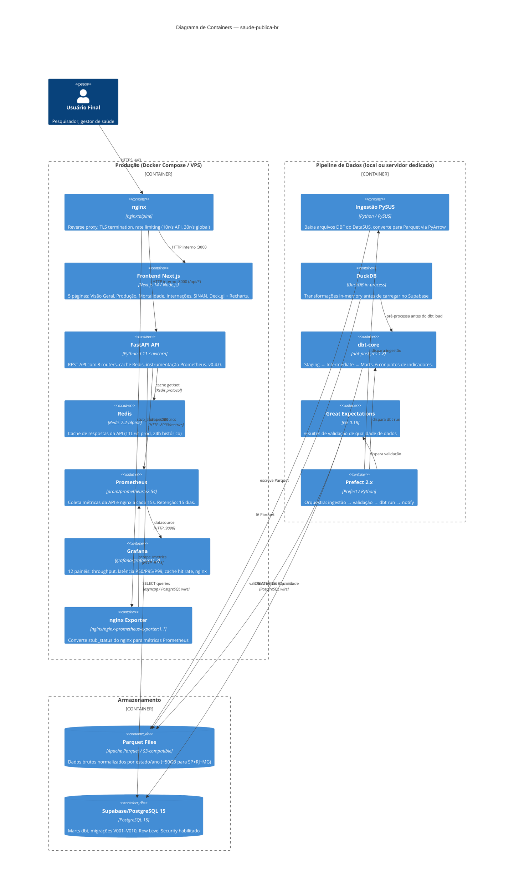

# Diagrama de Arquitetura C4 — saude-publica-br

> **C4 Model**: Context → Container → Component → Code
> Este documento cobre os níveis **Context** e **Container**.

---

## Nível 1 — Contexto do Sistema



---

## Nível 2 — Containers



---

## Fluxo de dados — Pipeline semanal

```
Segunda-feira 07:00 UTC
        │
        ▼ Prefect: weekly_pipeline.py
┌───────────────────┐
│ 1. Ingestão       │  PySUS → DBF → Parquet
│    (por estado)   │  ~30 min para SP/RJ/MG
└───────────────────┘
        │
        ▼
┌───────────────────┐
│ 2. Validação      │  Great Expectations
│    (6 suites)     │  Schema, ranges, completude
└───────────────────┘
        │ se OK
        ▼
┌───────────────────┐
│ 3. DuckDB         │  Transformações in-memory
│    pre-processing │  Deduplicação, tipos, joins
└───────────────────┘
        │
        ▼
┌───────────────────┐
│ 4. dbt run        │  staging → intermediate → marts
│    (PostgreSQL)   │  Migrations aplicadas
└───────────────────┘
        │
        ▼
┌───────────────────┐
│ 5. Cache bust     │  Redis FLUSHDB seletivo
│    + notify       │  Slack/email se erros
└───────────────────┘
```

---

## Camadas de banco de dados (PostgreSQL)

```
public schema
├── raw_*           ← staging dbt (dados normalizados)
├── int_*           ← intermediate dbt (enriquecidos)
└── mart_*          ← marts finais (lidos pela API)
    ├── mart_producao_ambulatorial
    ├── mart_mortalidade
    ├── mart_internacoes
    ├── mart_indicadores_acesso
    ├── mart_epidemiologia_cid10
    ├── mart_sazonalidade
    ├── mart_ranking_municipios
    ├── mart_anomalias
    ├── mart_doencas_notificaveis
    └── mart_capacidade_hospitalar
```

---

## Veja também

- [ADR-001](adr-001-pysus-parquet.md) — Escolha do PySUS + Parquet
- [ADR-002](adr-002-dbt-supabase.md) — Escolha do dbt + Supabase
- [ADR-003](adr-003-fastapi-redis.md) — Escolha do FastAPI + Redis
- [ADR-004](adr-004-prophet-anomaly.md) — Detecção de anomalias com Prophet
- [ADR-005](adr-005-nginx-prometheus.md) — Produção com nginx + Prometheus
